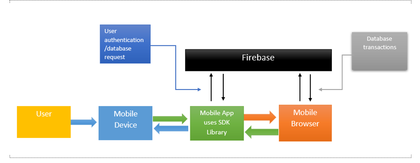

# Design Document

**Architecture Diagram**

The way the design of the architecture was thought out was mainly being in spaced based architecture. The beginning of the design is with having the application on the mobile device from there it will establish a connection with Firebase which is the designated database choosen for this project, the connection will be either by making a new account or logging in to a previously made account. Firebase will authenticate the user and then it will send bytes to the application in the mobile device that will display images, then the user will either like or dislike the image and this decision will be sent back to firebase for storing. Once enough decisions have been stored then firebase will send information to the backend of the application to compute an outline of the possibly preferences of the user which then it will change accordingly the images that it sends the mobile device to those it is believed to be of the liking of the user.

# Classes and Objects

## 1 Main Activity
In this class we have the main layout of the application with the image and two buttons that will be sent to firebase for storing. 

## 2 NewAccount 
This class we have two EditText for the user to input his email and the password. Also, there's a Firebase Authentication token which will give feedback on whether the new account was created successfully or not. The main objective for this class is to have users who do not have an account to be able to sign up to start usign the account.

## 3 LogInScreen
This class has the layout for the user to log in with two EditText variables which are used to check on firebase whether the user already has an account or if the user must sign up to use the application.

##  4 DisplayActivity
In this class the objective is for the user to be able to add their own pictures to the already extensive gallery of dogs. This is multiple buttons so that the user can open their phone gallery and select the image plus a token that will show the user if his picture was successfully uploaded to the database.

## 5 ImageActivity 
In this class the user is shown all the uploads to the database with the use of some databse references and an upload list to hold the pictures once retrieved from the database.
